# Contributing to Bluez-Dubbing

Bluez-Dubbing is the first open-source project for [Globluez](#notice) and the foundation for many more. We built it because we needed a reliable, budget-friendly dubbing stack for our MVP, and none of the available services (open or closed) matched the requirements without exploding costs. This repository is the first public iteration of that effort: an end-to-end pipeline crafted entirely from open tooling, designed to be battle-tested and extensible. As we grow, we’ll pair these core building blocks with proprietary ASR/MT/TTS models, but we remain committed to keeping the orchestration logic, reference implementations, and solid baseline models available to the community.

All contributions are welcome. Please review the guidelines below before opening an issue or PR.

## Pipeline Overview & Strategy Map

```mermaid
flowchart LR
    A["Media intake<br/>(upload, URL, cache token)"] --> B["Workspace setup<br/>+ hash-based caching"]
    B --> C{audio_sep?}
    C -->|true| D["Vocal/background stems<br/>`preprocessing.media_separation`"]
    C -->|false| E["Raw waveform reuse"]
    D & E --> F["ASR runner 0<br/>(`ASR_URL` whisperx)"]
    F --> G["Optional diarization & alignment<br/>ASR runner 1"]
    G --> H{target_work}
    H -->|sub| S1["Subtitle build<br/>`subtitles_handling`"]
    H -->|dub| I{translation_strategy}
    I -->|default/short| J["Segment-wise translation<br/>aligned ASR segments"]
    I -->|long_*| K["Full-text translation → `alignerWrapper`<br/>`Proportional` / `Sophisticated` aligners"]
    J & K --> L["TTS prompt attachment<br/>`attach_segment_audio_clips`"]
    L --> M["TTS synthesis<br/>`synthesize_tts`"]
    M --> N{perform_vad_trimming?}
    N -->|true| O["Silero VAD tail trim<br/>`trim_tts_segments`"]
    N -->|false| P["Use raw TTS clips"]
    O & P --> Q["Concatenate & stretch segments<br/>`concatenate_audio` (pyrubberband, weighted silence)"]
    Q --> R{dubbing_strategy}
    R -->|full_replacement| U["Replace original speech<br/>`apply_audio_to_video`"]
    R -->|translation_over| S{Sophisticated timing?}
    S -->|true| T["Envelope-based overlay<br/>`overlay_on_background_sophisticated`"]
    S -->|false| V["Segment overlay + ducking<br/>`overlay_on_background_default`"]
    U & T & V --> W["Final pass<br/>burn subs + mux output"]
    S1 --> W
```

### Quick Guidance on Pipeline Choices

- **ASR variants:** Runner `0` performs transcription (`raw_result`); runner `1` realigns segments with WhisperX word timings and optional diarization so downstream translation/TTS inherits reliable timestamps (`ensure_segment_ids` enforces deterministic IDs).

- **Translation modes:**  
  - `default` / `short`: translates each aligned segment independently; timing stays intact but context is limited, so use it when lip-sync is critical and segments are already meaningful.  
  - `long_proportional`: translates the full transcript as one block, then `ProportionalAligner` redistributes content by duration. Great for speeches or narrations where timing can stay monotonic.  
  - `long_sophisticated`: translates as one block and uses `SophisticatedAligner` (multilingual word alignment with reordering) for languages with different syntax. Gives the richest translations, and we already tuned it to keep boundaries natural even when segments must shift.  
  - `long_sophisticated_merging`: same as above but allows merges when segments have non-monotonic matches or empty targets after realignment—ideal for narrative content where sentences should flow together.

- **TTS prompt attachment:** `attach_segment_audio_clips` smart-cuts speaker-specific prompts (bounded by `prompt_attachment.min/max_duration`) so cloning-friendly TTS engines such as Chatterbox can stay conditioned on the real voice.

- **VAD trimming (`perform_vad_trimming`):** Runs Silero VAD inside `trim_audio_with_vad` to shave trailing silence on each synthesized clip before timing adjustments. Enable when long pauses cause audible gaps; disable if you require raw TTS for review.

- **Concatenation & stretching:** `concatenate_audio` resizes each clip with Rubberband, re-centers them inside their ASR slot, and inserts weighted silence so the stitched speech track matches the raw audio duration. This step also updates translation segment timings so later alignment and subtitles stay consistent.

- **Dubbing strategies:**  
  - `full_replacement`: replaces the entire vocal stem; typically used when source separation succeeded and you want fully localized audio.  
  - `translation_over`: keeps the original mix, pads/ducks it via FFmpeg side-chain compression, and lays TTS on top—useful for documentary-style narration where original ambience must stay audible.

- **Sophisticated dubbing timing (`sophisticated_dub_timing`):** Toggles the overlay backend. When `true`, `overlay_on_background_sophisticated` leverages the already concatenated speech track to craft a dynamic ducking envelope and guarantees perfect sample alignment; disable it to fall back to per-segment overlays (less CPU, tolerant when no clean speech track exists).

- **Subtitles-only path:** If `target_work=sub`, the pipeline stops after translation, builds style-aware subtitles (`STYLE_PRESETS`, `mobile` flag), and runs `finalize_media` only to burn captions (no TTS or overlay required).

> 🛈 Use `OPTIONS_ROUTE` (`/api/options`) to inspect available models and strategies before wiring new contributions to the orchestrator.

## Core Contribution Paths

1. **Pluggable service models (ASR, MT, TTS, separation).**  
   - Each microservice exposes a registry (`apps/backend/services/*/app/registry.py`) and an HTTP runner (`main.py`) that expect a uniform schema from `common_schemas`. When you add a model, register it with a unique key, implement a runner that adapts inputs/outputs to the shared `ASRRequest`, `TranslateRequest`, or `TTSRequest`, and document the expected parameters.  
   - Timing-aware MT is the holy grail: if you can deliver translation output that already respects segment boundaries (e.g., via token-level alignment, sentence-duration metadata, or bilingual CTC alignments), plug it under a new translation strategy and show how it reduces the need for post-alignment in `alignerWrapper`.  
   - On the TTS side, we welcome models that accept prompt audio, handle multi-speaker cloning, and respect requested durations. Make sure regenerated clips still pass through `trim_tts_segments` and `concatenate_audio` gracefully, or extend those utilities if your model emits timing metadata we can trust instead of stretching.

2. **Algorithm upgrades (translation alignment, audio sync, subtitles).**  
   - The “long_*” strategies ride on `map_by_text_overlap`, `ProportionalAligner`, and `SophisticatedAligner` in `apps/backend/libs/common-schemas/common_schemas/utils.py`. We already ship solid defaults, but if you can push boundaries—better segmentation, bilingual attention hints, improved reordering—open a PR with tests (`services/orchestrator/tests`).  
   - Audio sync today stretches clips with Rubberband, re-centers them, and overlays them via background stems or translation-over FFmpeg chains. Those heuristics are in production already; if you spot refinements (DTW-based stretching, phoneme-aware envelopes, smarter silence budgeting), prototype them and send a PR with before/after logs.  
   - Subtitle alignment (`media_processing/subtitles_handling.py`) already optimizes for style presets. Enhancements for Netflix-grade constraints, mobile-first layouts, or metadata-driven timing are encouraged—just explain the gains and include sample outputs.

3. **Service-to-service networking and throughput.**  
   - Each service speaks HTTP via FastAPI + `httpx`. There is room to reduce latency with streaming payloads, shared caches (e.g., `models_cache`, `cache/audio_*`), connection pooling, or binary transports for large audio blobs. Contributions that shrink round trips (batched translation, gRPC, shared filesystem volumes) are highly encouraged as long as they stay opt-in and backward compatible.  
   - If you improve orchestration-level retries, circuit breaking, or telemetry, document the knobs in `README.md` and expose sane defaults in `common-schemas/config/control_center.yaml`.

4. **Bug fixes and enhancements.**  
   - Anything that improves developer experience, fixes regressions, or adds observability is welcome. Please open an issue describing the current behavior, the expected outcome, and reproduction steps. For PRs touching critical paths, include tests (`make test`) and sample logs to prove latency or quality wins.

Before submitting, ensure `make test` passes, adhere to the existing code style (ruff/black compatible), and keep changes modular so reviewers can understand each improvement in isolation.

## Contribution Workflow & Expectations

1. **Discuss first:** For sizeable changes, open a GitHub issue outlining the problem, the proposed approach, and any alternative solutions you considered. This prevents duplicate work and lets maintainers share constraints early.
2. **Fork + branch:** Work on a feature branch named after the issue or feature (`feature/timing-aware-mt`, `fix/overlay-race`). Keep commits focused; squash noisier WIP commits before opening the PR.
3. **Document the impact:** Every PR description must clearly state:
   - The problem being solved or the enhancement delivered.
   - How the solution works (diagrams, configs, CLI examples welcome).
   - Logs, benchmarks, or qualitative results that prove the improvement (include paths under `apps/backend/outs/*` when relevant).
4. **Test locally:** Run `make test` (and any additional service-specific tests) before submission. If your change requires GPU models or long-running integration tests, let reviewers know which ones you executed and how to reproduce them.
5. **Stay engaged:** Be ready to answer follow-up questions, justify trade-offs, or adjust the implementation. PRs may stall if the author goes silent; unresolved feedback can lead to closing the request.

### Best Practices & Recommendations

- Keep changes atomic and self-explanatory. If you touch multiple areas (e.g., translation + TTS), split into separate PRs unless the change is inseparable.

- Update documentation (`README.md`, this file, or inline docstrings) whenever you introduce new config keys, CLI flags, or behavior toggles.

- Provide fallback paths or feature flags when adding experimental models or protocols so users can opt out easily.

- For bug fixes, include regression tests or explain why tests are impractical.

- When using AI-assisted code generation, you are fully responsible for verifying the output: review it line by line, ensure it matches project conventions, and prove that it doesn’t break existing flows (tests, dry runs, or sample jobs).

### Code of Conduct & Professionalism

- This project follows the spirit of the [Contributor Covenant](https://www.contributor-covenant.org/). By participating, you agree to treat the community with respect, give credit where due, and avoid harassment or discriminatory language.
- Be self-aware about the code you submit. Understand every line, be prepared to defend design decisions, and don’t submit “black box” patches you can’t maintain.
- Clearly flag if part of your change is experimental or high risk, and call out any follow-up work that might still be needed.
- If you leverage AI tools, double-check licenses, sanitize generated content, and confirm the resulting code passes all tests before opening a PR. “The model said so” is not an acceptable justification for regressions.

---

### 📣 Notice

**Globluez** is a startup in creation, aiming to build an innovative **virtual tourism platform** that leverages **AI** to help people explore the world and plan their travels with ease.

We are looking for a **hyper-talented Software Engineer** with many years of experience — someone **vision-driven, passionate, and hardworking**, capable of building an MVP rapidly and iterating fast.

The ideal candidate should have:

* Expertise in **full-stack development**
* A strong background in **AI and Machine Learning**
* The ability to **design scalable systems** that can support rapid global user growth
* A mindset suited to the **challenges of early-stage scaling**

You’ll be joining as **CTO** on this exciting startup journey.

If you believe you’re the right fit for this role, feel free to reach out at **[contactglobluez@gmail.com](mailto:contactglobluez@gmail.com)**.

Discover more about us: [https://globluez.com](https://globluez.com)
